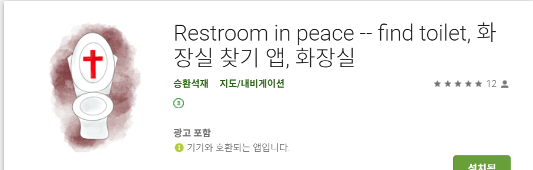

# rip-client

화장실찾기 안드로이드앱(2019.05.13 ~ 2019.05.25 (약 2주))

ReactNative, Expo, Node.js, Express.js, MySQL, Sequelize.js, Passport, AWS

플레이 스토어<a href="https://play.google.com/store/apps/details?id=com.seunghwanseokjae.seunghwan&hl=ko"> 바로가기 </a>

내주변 또는 지도를 이동하여 지도중심에서 반경 200M이내의 화장실을 찾을수 있다.
     

  
  
  
  
 

 
 내가 있는 현재의 위치를 똥으로 표시 
 주변의 화장실은 하트로 표시  
 하트를 클릭하면 화장실의 상세주소와 별점 평가등을 확인 작성  
 내가있는 위치에 화장실 추가기능  
 좌측아래 아이콘을 터치하여 현재내위치로 지도중심  
 지도를 이동하면 지도의 중심으로부터 화장실을 찾을수 있다.
